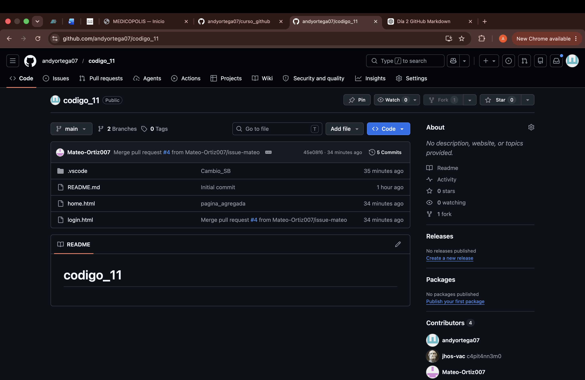
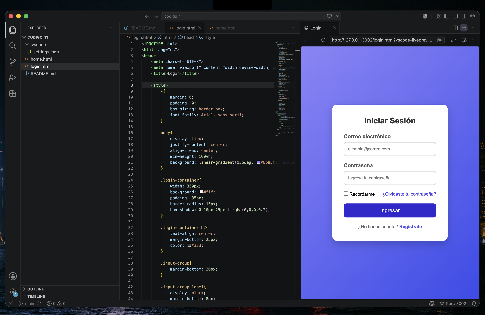
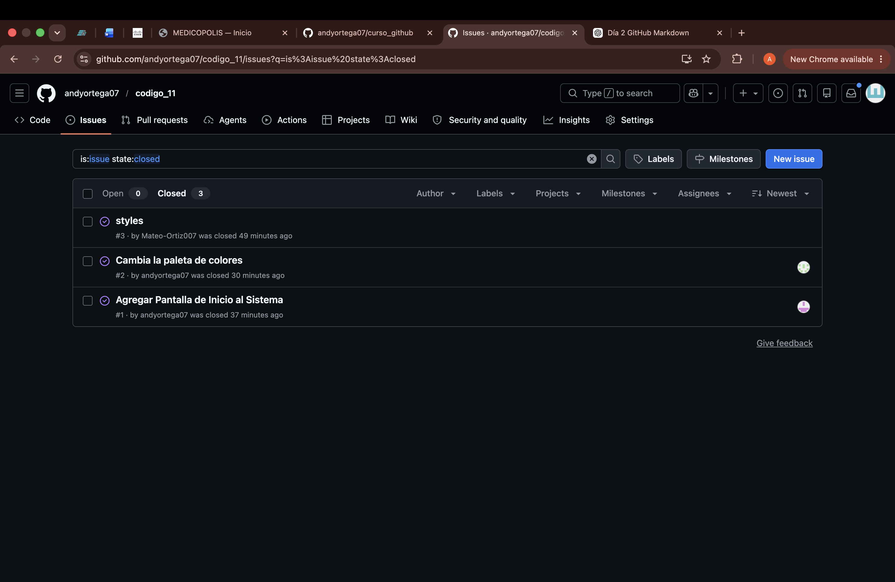
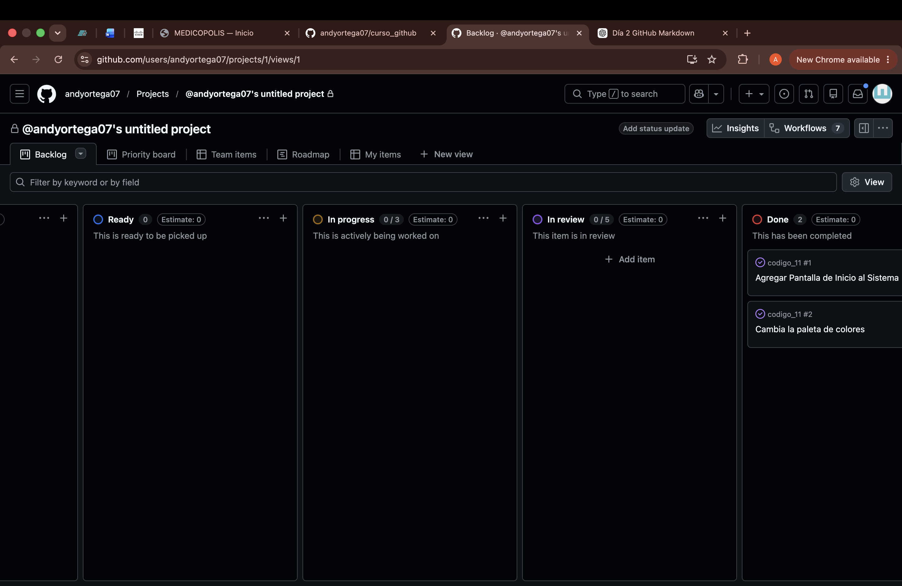
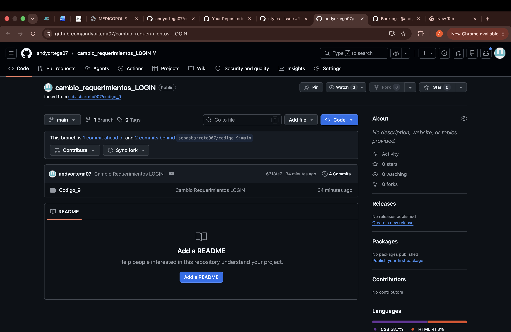
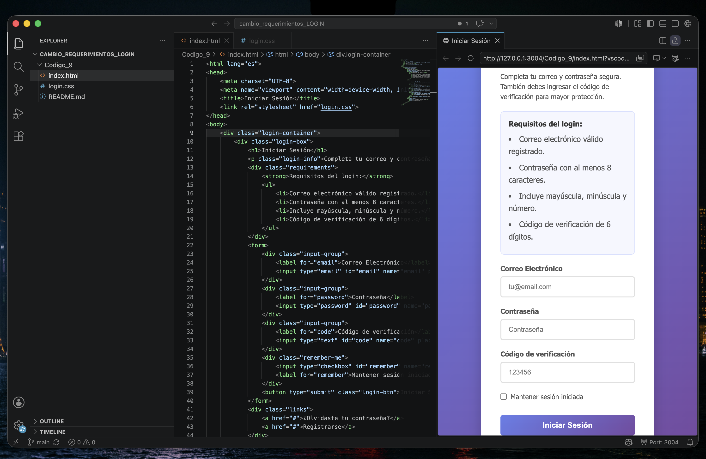
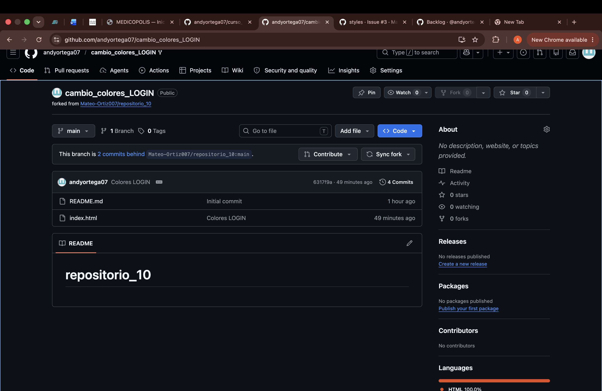
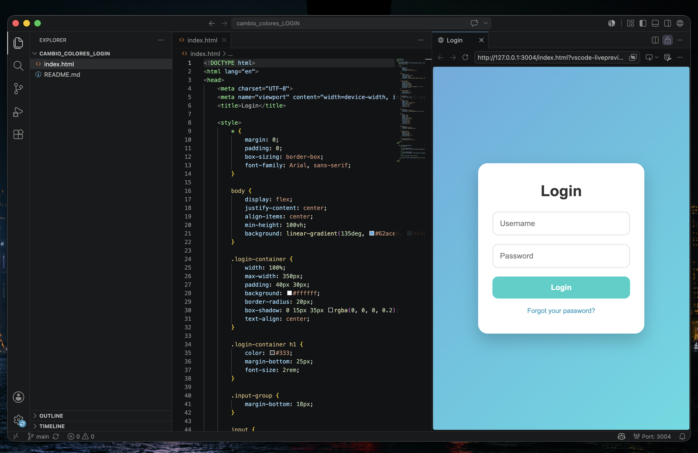

# 📅 Día 2 - Práctica con GitHub

##  Información general

| Dato | Descripción |
|------|-------------|
| Repositorio principal | `codigo_11` |
| Fecha | 17/06/2026 |
| Objetivo | Practicar el uso de repositorios, *issues*, colaboración, *forks* y gestión de proyectos con Kanban. |

---

##  Objetivos del día

- Crear un repositorio en GitHub.
- Desarrollar un formulario de inicio de sesión (*login*).
- Gestionar tareas mediante *issues*.
- Colaborar con otros usuarios.
- Organizar el trabajo utilizando un tablero Kanban.
- Realizar contribuciones a proyectos externos mediante *forks*.

---

## 📂 Repositorio creado

Se creó el repositorio **`codigo_11`**, donde se desarrolló una interfaz básica de inicio de sesión en HTML.

### Funcionalidades implementadas

- Campo de usuario.
- Campo de contraseña.
- Botón de inicio de sesión.
- Diseño básico del formulario.

---

## Evidencias

### Repositorio creado

### Interfaz del login

---

## 👥 Trabajo colaborativo

Se asignaron tareas a dos colaboradores utilizando la herramienta de **Issues** de GitHub.

### Issues creados

| Issue | Descripción | Responsable | Estado |
|-------|-------------|-------------|--------|
| #1 | Realizar mejoras en el diseño del login | Colaborador 1 | ✅ Completado |
| #2 | Agregar cambios solicitados al formulario | Colaborador 2 | ✅ Completado |

### Evidencia de los issues

---

## 📋 Gestión del proyecto con Kanban

Se creó un tablero de proyecto utilizando la metodología **Kanban** para organizar las tareas del repositorio.

### Columnas del tablero

- 📝 **To Do**
- 🚧 **In Progress**
- ✅ **Done**

Una vez que los colaboradores finalizaron sus actividades, las tareas fueron movidas a la columna **Done**.

### Evidencia del tablero Kanban

---

## 🔀 Contribuciones a proyectos externos

Además del trabajo realizado en el repositorio principal, se participó en dos proyectos externos mediante el uso de **forks**.

### Proceso realizado

1. Se creó un *fork* de cada repositorio.
2. Se clonaron los proyectos en el entorno local.
3. Se implementaron los cambios solicitados.
4. Se subieron las modificaciones al repositorio personal (*fork*).

### Cambios realizados

| Proyecto | Modificación realizada |
|----------|------------------------|
| Proyecto 1 | Actualización de los requerimientos del login |
| Proyecto 2 | Modificación de la paleta de colores |

### Evidencias

#### Fork del proyecto 1

#### Cambios en los requerimientos del login

#### Fork del proyecto 2

#### Nueva paleta de colores

---

## 🛠️ Herramientas utilizadas

- Git
- GitHub
- Issues
- Projects (Kanban)
- Forks
- Markdown
- HTML

---

## 📚 Aprendizajes obtenidos

- Crear y administrar repositorios en GitHub.
- Asignar tareas mediante *issues*.
- Coordinar el trabajo con colaboradores.
- Utilizar tableros Kanban para gestionar proyectos.
- Contribuir a proyectos externos mediante *forks*.
- Documentar el proceso utilizando Markdown.

---

## 🚀 Conclusión

Durante esta práctica se fortalecieron habilidades relacionadas con el trabajo colaborativo en GitHub, la gestión de tareas mediante *issues* y la organización de proyectos con tableros Kanban. Además, se adquirió experiencia contribuyendo a proyectos externos utilizando la funcionalidad de *forks*.