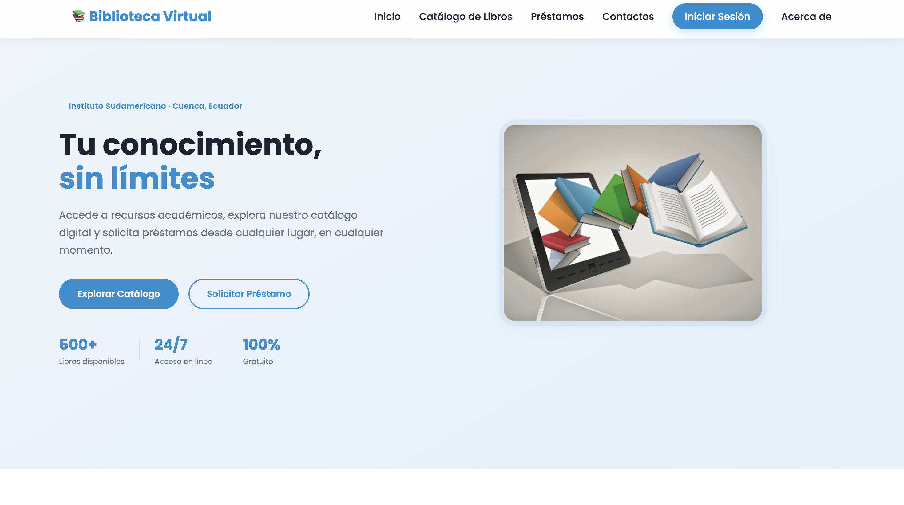
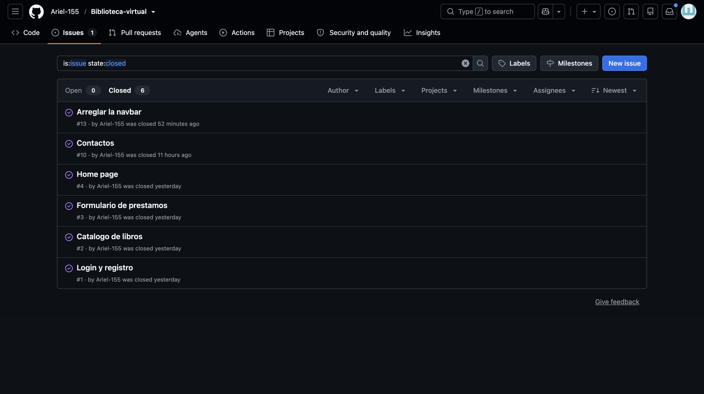
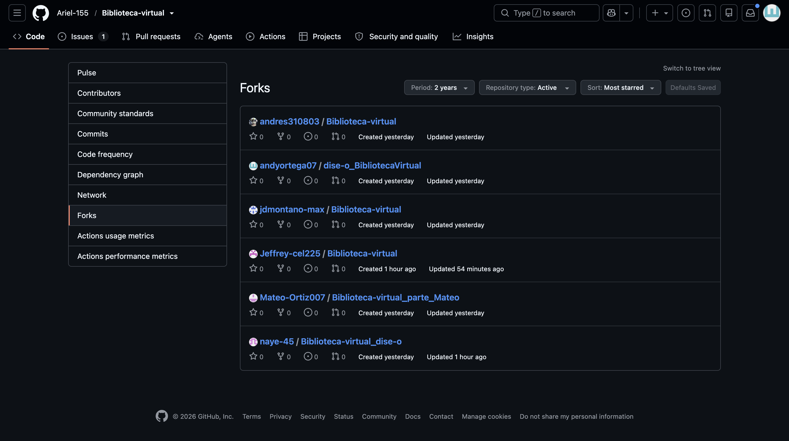
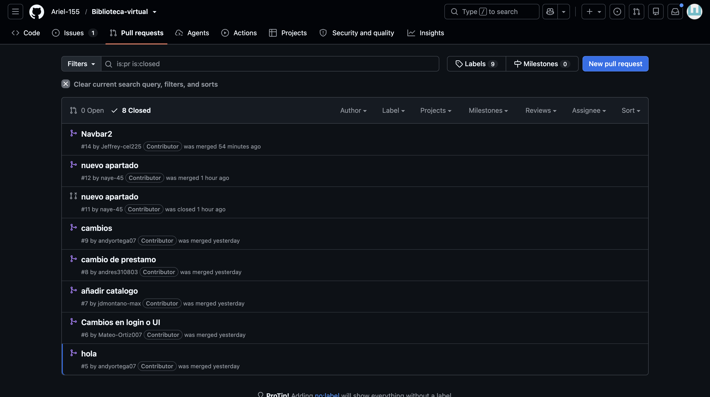

# 📅 Día 3 - Desarrollo Colaborativo de una Biblioteca Virtual

## Información general

| Dato | Descripción |
|------|-------------|
| Proyecto | Biblioteca Virtual |
| Integrantes | 6 colaboradores |
| Fecha | 19/06/2026 |
| Objetivo | Desarrollar un sistema web de biblioteca virtual aplicando metodologías de trabajo colaborativo con GitHub y Gitflow . |

---

## 🎯 Objetivos del día

- Desarrollar un sistema de biblioteca virtual en equipo.
- Organizar las tareas mediante *issues*.
- Implementar un flujo de trabajo basado en *forks*.
- Gestionar la integración de cambios realizados por cada integrante.
- Aplicar buenas prácticas de colaboración utilizando GitHub.

---

## 📚 Descripción del proyecto

Se desarrolló un sistema de **Biblioteca Virtual** con el propósito de facilitar la gestión y consulta de libros mediante una interfaz web intuitiva.

Cada integrante del equipo fue responsable de una tarea específica, permitiendo un desarrollo paralelo y organizado.

---

## 👥 Equipo de trabajo

El proyecto contó con la participación de **seis colaboradores**, quienes trabajaron de manera coordinada mediante la asignación de tareas individuales.

### Distribución de tareas

| Integrante | Tarea asignada |
|------------|----------------|
| MATEO ORTIZ | Desarrollo del módulo de registro de usuarios |
| DAVID MONTANO | Implementación del sistema de préstamos |
| ANDRES VILLACIS | Gestión del catálogo de libros |
| ANDRES VILLACIS Y DAVID MONTANO | Desarrollo del sistema de búsqueda |
| ARIEL LARGO | Implementación de funcionalidades adicionales y jefe del grupo|
| ANDY ORTEGA Y NAYELI GALLEGOS | Diseño de la interfaz y creación de la página de inicio |

---

## 🎨 Mi contribución al proyecto

Mi responsabilidad dentro del equipo fue desarrollar el **diseño visual del sistema** y la **pantalla de inicio** de la Biblioteca Virtual.

### Actividades realizadas

- Diseño de la interfaz principal.
- Definición de la estructura visual del sistema.
- Creación de la página de inicio.
- Organización de los elementos de navegación.
- Implementación de estilos para mejorar la experiencia de usuario.

### Evidencia del diseño y la página de inicio



---

## 📝 Gestión de tareas con Issues

Se utilizaron **Issues de GitHub** para organizar, asignar y realizar el seguimiento de las tareas del proyecto.

### Proceso de trabajo

1. Creación de un *issue* por cada funcionalidad.
2. Asignación del responsable correspondiente.
3. Desarrollo individual de cada tarea.
4. Revisión y cierre del *issue* una vez completado.

### Evidencia de los issues



---

## 🔀 Flujo de trabajo con Forks

Cada integrante creó un **fork** del repositorio principal para desarrollar su tarea de forma independiente.

### Proceso seguido

1. Crear un *fork* del repositorio principal.
2. Clonar el repositorio en el entorno local.
3. Implementar los cambios asignados.
4. Subir las modificaciones al repositorio personal.
5. Solicitar la integración de los cambios al proyecto principal.

Este proceso permitió mantener un desarrollo ordenado y evitar conflictos entre las contribuciones de los integrantes.

### Evidencia de los forks



---

## 🔄 Integración de cambios

Una vez finalizadas las tareas, las contribuciones de cada integrante fueron revisadas e integradas al repositorio principal.

### Evidencia de la integración



---

## 🛠️ Herramientas utilizadas

- Git
- GitHub
- Issues
- Forks
- Pull Requests
- HTML
- CSS
- JavaScript
- Markdown

---

## 📂 Estructura del proyecto

```text
biblioteca-virtual/
│── images/
│   ├── diseno-inicio-biblioteca.png
│   ├── issues-biblioteca.png
│   ├── forks-biblioteca.png
│   └── pull-requests.png
│── css/
│── js/
│── pages/
│── index.html
│── README.md